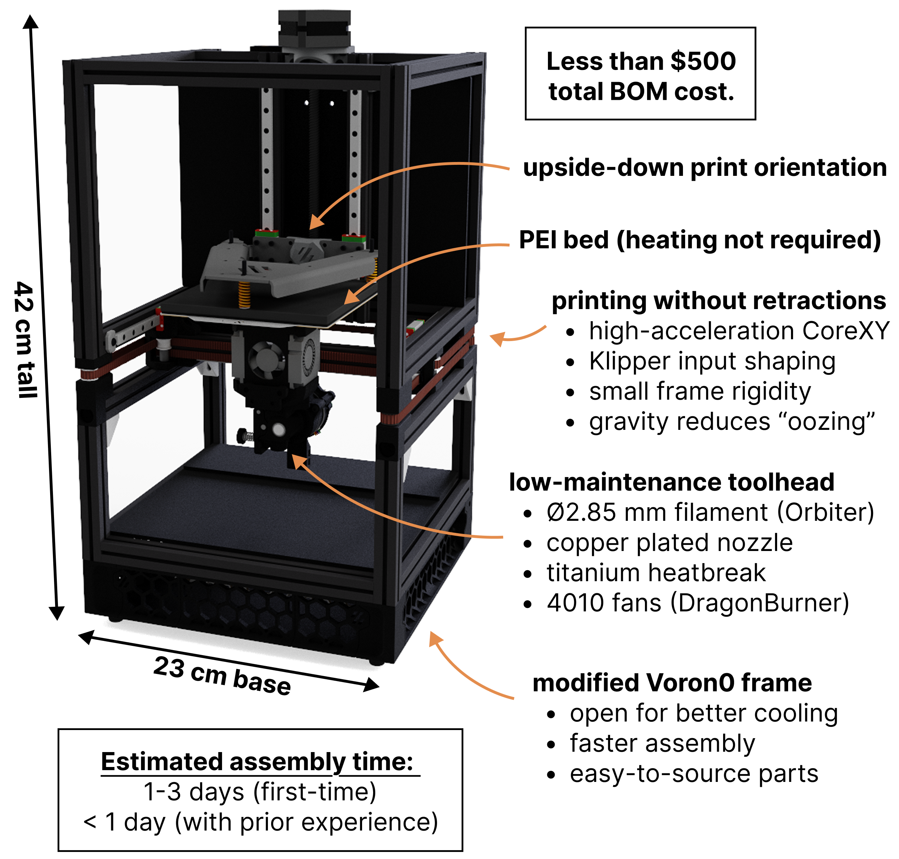

# Flex Printer

The Flex Printer is an open-source project aimed at solving the key print reliability difficulties associated with printing ultra-flexible elastomers (i.e. shore hardness of around 80A and below). It is based on the [Voron 0.2](https://github.com/VoronDesign/Voron-0) frame and motion system, but has been heavily modified, and stripped down to remove unnecessary parts; the resulting assembly is much easier to build and use, especially for newcomers to the field.

The project is aimed at providing a democratised platform for carrying out research in soft robotics involving the printing of soft elastomers (e.g. for fluidic soft robots).
The printer can be built for less than $500, with the total assembly time estimated at 1-3 days for first-time users (and under 1 day for those with prior experience).

<!-- 

</img> -->

## Table of Contents
* [Overarching philosophy](#overarching-philosphy)
* [Key features](#key-features)
* [Printing impossible geometries](#printing-previosly-unfeasible-geometries)
* [Getting started](#getting-started)
* [Join the official Discord channel](#join-the-official-discord-channel)
* [How to contribute](#how-to-contribute)

## Overarching philosophy
The original Voron printers are very fun to build, but can be an arduous process for first-time builders; it is a platform designed primarily with hobbyists in mind. The Flex Printer has been optimised to simplify the assembly and usage of the printer as much as possible. The guidance provided in this repository aims to prevent future users of the platform from having the face the same challenges that the authors had to face when building Voron printers. The project follows a Keep It Simple, Stupid (KISS) philosophy, omitting decorative elements and any parts deemed unnecessary. These can, of course, be added back by the users to customise their builds.

## Key features

- Upside-down print orientation
    - Stabilises thin membranes during printing, and helps to keep them airtight (key for printing fluidic soft robots).
    - Allows to print arbitrarily tall slender structures (such as walls and columns). It is now possible to print geometries which previously would have collapsed under their own weight.
    - Enables better bridging and minimises the risk of blockage of fluidic channels (enabling to build more tightly integrated fluidic architectures).
    - Enables to suspend parts on thin strands of filament ("aero supports"), and print parts in virtually any print orientation.
- The printer can print parts in virtually any orientation
    - (Using "aero" support, as explained in the previous point).
    - Unlocks possibilities for creating entirely new types of fluidic machines, soft robots, and metamaterials.
- Low-maintenance, modified extruder
    - Use of 2.85 mm filament, which is 7 times harder to buckle than 1.75 mm.
    - Eliminates the issue of flexible filament tangling itself around extruder gears.
    - The larger cross section allows to generate more force, and gives more control over how the filament is pushed out of the nozzle.
    - Increased maximum printing speeds.
    - Copper-plated nozzle and titanium alloy heatbreak minimise the risk of clogged nozzles.
- Heat bed completely removed to simplify assembly, and operation
    - TPU provides excellent adhesion to the PEI textured sheet, even in the upside-down orientation.
- Open-frame design
    - The lack of enclosure allows for better cooling and significantly simplifies the assembly.
- Compact and portable
    - The printer fits on any desktop (42 x 23 x 23 cm footprint).
    - It can be easily transported, and used even at remote locations, which unlocks new applications.
    - The 120x120x120 mm build volume is sufficient given the current scale of fluidic soft systems. Future development may involve the creation of larger printer size variants.
- Printing without retractions
    - Printing upside down minimises filament oozing.
    - Printing at high accelerations and travel speeds minimises the need for retraction; made possible through CoreXY + Klipper input shaping + small rigid frame. 

## Printing previosly unfeasible geometries

## Getting started
- Follow the part sourcing guide in the [BOM_Sourcing_Guide](https://github.com/The-Soft-Robotics-Forum/flex-printer/tree/main/BOM_Sourcing_Guide) folder to procure the parts needed to build the printer.
- If your BOM doesn't include all of the required parts, print the remaining ones using the resources available in the [Print_These_Parts](https://github.com/The-Soft-Robotics-Forum/flex-printer/tree/main/Print_These_Parts) folder.
- Follow the build instructions in the [Build_Instructions](https://github.com/The-Soft-Robotics-Forum/flex-printer/tree/main/Build_Instructions) folder to build the printer and get it ready for printing your first parts.
- Visit the [Fluidic Machine Bestiary](https://github.com/The-Soft-Robotics-Forum/fluidic-machine-bestiary) for a repository of ready-to-print monolithic robots. The Bestiary also contains an expanding library of fluidic control, actuator, and sensor components that use can use to build your own, entirely new, soft robots.

## Join the official Discord channel
We have set up a dedicated [Discord channel](https://discord.gg/4RNmUT7A5G) on the Soft Robotics Forum server. It's a great way to ask for help and advice when assembling and using the printer, as well as to connect with other members of the community, and start contributing your own ideas to the project.

## How to contribute
This is a beginner guide for forking github repositories and contributing to project. If you have prior experience, skip to [Step 6](#Step-6:-Pull-Request. If you plan to contribute to the project, keep in mind that it is under the same license as the standard Voron printers; please see the LICENSE file for full details.
### Step 1: Fork the repo
1. Click the "Fork" button in the top-right corner of the page - [1](https://www.freecodecamp.org/news/how-to-fork-a-github-repository/).
2. Chose where to fork the repository.
### Step 2: Clone your forked repo
1. Go to your forked repo and copy the URL that appears when the green code button is clicked. 
2. Open a terminal on your computer and run `git clone [URL]` [2](https://www.gitkraken.com/learn/git/problems/github-how-to-fork).
### Step 3: Create a branch 
1. Navigate to your recently cloned repo on your pc via terminal.
2. `git checkout -b [NEW_BRANCH_NAME]` where new_branch_name is the name you wish to give your branch.
### Step 4: Make changes 
1. Make your desired changes to the part files keep note of the voron naming scheme and be consistent.
2. Run `git add .`
3. Run `git commit -m "a detailed message of the changes you have made"`
### Step 5: Push changes and create a pull request
1. `git push origin [NEW_BRANCH_NAME]`
2. Go to your fork on the github website and select compare and pull request.
3. Fill in the pull request details.
### Step 6: Pull request
- Provide a clear and concise title for the pull request.
- Include a detailed description of the part changes you have made and why.
	- If you have introduced new parts make sure the naming is consistent with the in place naming scheme.
	- If you have introduced new hardware please provide a BOM for this.
