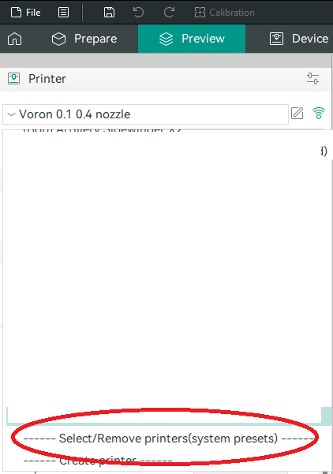
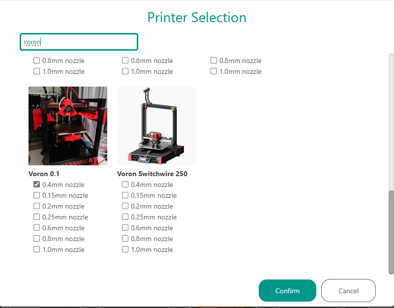
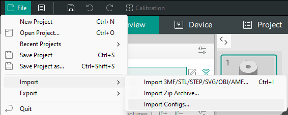

# FLEX PRINTER ORCA INSTALL GUIDE 

## Step 1 
- Install the latest release of OrcaSlicer from their github releases page if you have not done so: [Orca Github](https://github.com/SoftFever/OrcaSlicer/releases_)

## Step 2 
- Select the preview tab, go to printer drop down, and select `Select/Remove printers(system presets)`
    - if this is your first install of orcaslicer the page will likely look a little different, but the steps are much the same 

## Step 3 
- Enter `Voron` into the search 
- Select the Voron 0.1 with 0.4 mm nozzle (or whatever nozzle size you have installed) 
- Press Confirm

## Step 4
- Ensure the Voron is selected in the drop down
- In the top left of the screen go to file/import/import configs...
- Locate the `orca_slicer_presets.orca_printer` file available [here](https://github.com/The-Soft-Robotics-Forum/flex-printer/blob/main/Software/orca_slicer_presets.orca_printer)
- This will make the Flex Printer presets available as options on the voron printer model 

